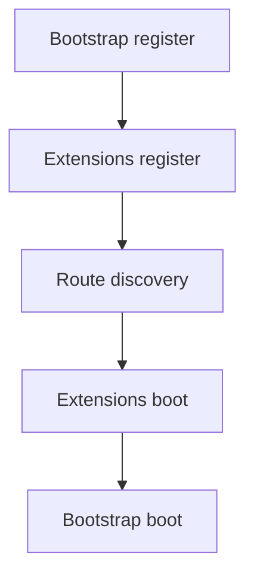

<!-- locale-guard:language-bar:start -->
** English** | [ Español](../../../i18n/es/architecture/core/application-lifecycle.md) |  Deutsch *(missing)* |  日本語 *(missing)*
<!-- locale-guard:language-bar:end -->

# Application Lifecycle – Bluewater Framework

📄 **File:** `docs/en/architecture/core/application-lifecycle.md`
📅 **Status:** Published
🏷️ **Tags:** architecture, bootstrap, lifecycle
🔖 **Version:** 8.0.0
📅 **Date:** 2026-09-03
🌍 **Scope:** Application construction, boot ordering, and request execution
🤝 **Contributors:** Framework architects and maintainers
👨‍💻 **Author:** Bluewater Documentation Team

---

> ### 🪶 **Bluewater Principle**
> *Lifecycle hooks are few, ordered, and explicit.*

---

## 📌 Purpose

This document defines how a named application is created, booted once, and used to handle requests.

## Construction

`Host::application()` rejects names outside `[A-Za-z0-9_.-]`, preventing callers from supplying arbitrary paths. It verifies the application directory, creates `cache/` and `logs/` when required, resolves configuration, registers the application namespace, and wires core services.

## Boot sequence

Successful boot is idempotent. A later `boot()` call returns without repeating callbacks. If a callback or discovery step throws, the exception escapes and the application is not marked as booted.

## Request lifecycle

`Application::handle()` matches a route, combines middleware, dispatches the endpoint, and returns a response. The method is the application error boundary: no exception escapes it. `Application::run()` delegates request acquisition and response emission to a `RuntimeAdapter`.

## 📚 Related Documents

- [System overview](index.md)
- [Extensions](extensions.md)
- [Runtime and deployment](../runtime/deployment.md)

---

This documentation is licensed under the [MIT License](../../../../LICENSE).

---

*Last updated: 2026-09-03*
