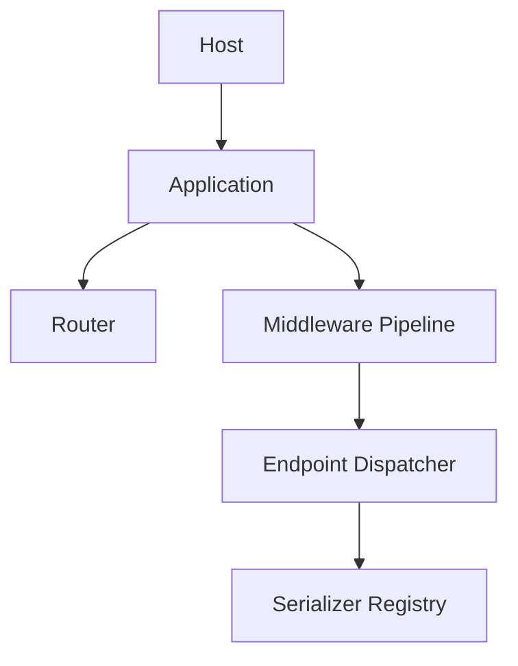

<!-- locale-guard:language-bar:start -->
** English** |  Español *(missing)* |  Deutsch *(missing)* |  日本語 *(missing)*
<!-- locale-guard:language-bar:end -->

# System Overview – Bluewater Framework

📄 **File:** `docs/en/architecture/system-overview.md`  
📅 **Status:** Published  
🏷️ **Tags:** architecture, system, request-flow  
🔖 **Version:** 8.0.0  
📅 **Date:** 2026-09-03  
🌍 **Scope:** Runtime components and the request path  
🤝 **Contributors:** Framework architects and maintainers  
👨‍💻 **Author:** Bluewater Documentation Team

---

> ### 🪶 **Bluewater Principle**
> *A small kernel should make ownership and execution order obvious.*

---

## 📌 Purpose

This document defines the high-level composition of one Bluewater host and the path of one request through an isolated application.

## Runtime composition

`Host` validates the application name, resolves its root, creates writable runtime directories, builds configuration, registers application autoloading, and constructs the application collaborators. `Application` owns bootstrap and request coordination. It delegates route discovery and matching to `Router`, policy composition to `Pipeline`, parameter binding and invocation to `EndpointDispatcher`, and representation selection to `SerializerRegistry`.

## Request path

1. A runtime adapter creates a Bluewater `Request`.
2. The router matches the uppercase HTTP method and normalized path.
3. Global middleware runs before directory, endpoint-class, and endpoint-method middleware.
4. The dispatcher binds route values, query values, request objects, DTOs, services, or defaults.
5. The endpoint executes application behavior.
6. The serializer returns an immutable Bluewater `Response`.
7. The runtime adapter emits that response.

Route misses become RFC 7807-compatible 404 responses. Other uncaught failures become 500 problem responses. Exception details appear only when the resolved environment is `development`.

## 📚 Related Documents

- [Application lifecycle](application-lifecycle.md)
- [Routing and dispatch](routing-and-dispatch.md)
- [HTTP and serialization](http-and-serialization.md)

---

This documentation is licensed under the [MIT License](../../../LICENSE).

---

*Last updated: 2026-09-03*
