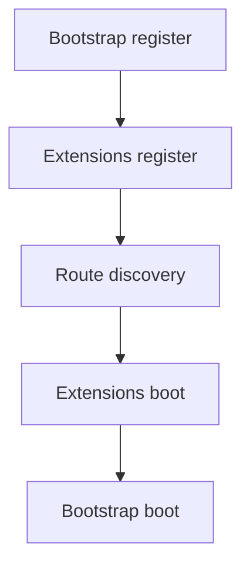

<!-- locale-guard:language-bar:start -->
[ English](../../../../en/architecture/core/application-lifecycle.md) | ** Español** |  Deutsch *(missing)* |  日本語 *(missing)*
<!-- locale-guard:language-bar:end -->

# Ciclo de vida de la aplicación – Bluewater Framework

📄 **Archivo:** `docs/i18n/es/architecture/core/application-lifecycle.md`
📅 **Estado:** Publicado
🏷️ **Etiquetas:** architecture, bootstrap, lifecycle
🔖 **Versión:** 8.0.0
📅 **Fecha:** 2026-09-03
🌍 **Alcance:** Construcción de la aplicación, orden de arranque y ejecución de solicitudes
🤝 **Colaboradores:** Arquitectos y mantenedores del framework
👨‍💻 **Autor:** Equipo de documentación de Bluewater

---

> ### 🪶 **Principio de Bluewater**
> *Los enlaces del ciclo de vida son pocos, ordenados y explícitos.*

---

## 📌 Propósito

Este documento define cómo se crea una aplicación con nombre, se inicia una sola vez y se utiliza para manejar solicitudes.

## Construcción

`Host::application()` rechaza los nombres que no cumplan `[A-Za-z0-9_.-]`, lo que impide que los llamadores proporcionen rutas arbitrarias. Verifica el directorio de la aplicación, crea `cache/` y `logs/` cuando es necesario, resuelve la configuración, registra el espacio de nombres de la aplicación y conecta los servicios principales.

## Secuencia de arranque

Un arranque correcto es idempotente. Una llamada posterior a `boot()` retorna sin repetir las devoluciones de llamada. Si una devolución de llamada o un paso de descubrimiento genera una excepción, esta se propaga y la aplicación no se marca como iniciada.

## Ciclo de vida de la solicitud

`Application::handle()` encuentra una ruta, combina el middleware, despacha el endpoint y devuelve una respuesta. El método es el límite de errores de la aplicación: ninguna excepción se propaga fuera de él. `Application::run()` delega la obtención de solicitudes y la emisión de respuestas a un `RuntimeAdapter`.

## 📚 Documentos relacionados

- [Descripción general del sistema](index.md)
- [Extensiones](extensions.md)
- [Entorno de ejecución y despliegue](../runtime/deployment.md)

---

Esta documentación se distribuye bajo la [Licencia MIT](../../../../../LICENSE).

---

*Última actualización: 2026-09-03*
