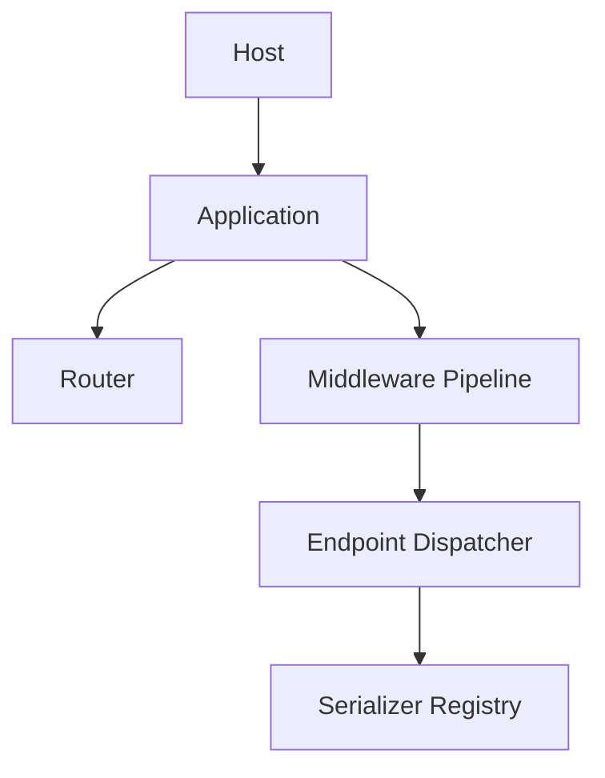

<!-- locale-guard:language-bar:start -->
[ English](../../../../en/architecture/core/index.md) | ** Español** |  Deutsch *(missing)* |  日本語 *(missing)*
<!-- locale-guard:language-bar:end -->

# Descripción general del sistema – Bluewater Framework

📄 **Archivo:** `docs/i18n/es/architecture/core/index.md`
📅 **Estado:** Publicado
🏷️ **Etiquetas:** architecture, system, request-flow
🔖 **Versión:** 8.0.0
📅 **Fecha:** 2026-09-03
🌍 **Alcance:** Componentes del entorno de ejecución y recorrido de la solicitud
🤝 **Colaboradores:** Arquitectos y mantenedores del framework
👨‍💻 **Autor:** Equipo de documentación de Bluewater

---

> ### 🪶 **Principio de Bluewater**
> *Un núcleo pequeño debe hacer evidentes la propiedad y el orden de ejecución.*

---

## 📌 Propósito

Este documento define la composición de alto nivel de un host de Bluewater y el recorrido de una solicitud a través de una aplicación aislada.

## Composición del entorno de ejecución

`Host` valida el nombre de la aplicación, resuelve su raíz, crea directorios escribibles para el entorno de ejecución, construye la configuración, registra la carga automática de la aplicación y construye sus colaboradores. `Application` controla el arranque y la coordinación de solicitudes. Delega el descubrimiento y la coincidencia de rutas a `Router`, la composición de políticas a `Pipeline`, el enlace y la invocación de parámetros a `EndpointDispatcher`, y la selección de representación a `SerializerRegistry`.

## Recorrido de la solicitud

1. Un adaptador del entorno de ejecución crea una `Request` de Bluewater.
2. El enrutador compara el método HTTP en mayúsculas y la ruta normalizada.
3. El middleware global se ejecuta antes que el middleware de directorio, clase de endpoint y método de endpoint.
4. El despachador enlaza valores de ruta, valores de consulta, objetos de solicitud, DTO, servicios o valores predeterminados.
5. El endpoint ejecuta el comportamiento de la aplicación.
6. El serializador devuelve una `Response` inmutable de Bluewater.
7. El adaptador del entorno de ejecución emite esa respuesta.

Las rutas no encontradas se convierten en respuestas 404 compatibles con RFC 7807. Otros fallos no capturados se convierten en respuestas de problema 500. Los detalles de las excepciones solo aparecen cuando el entorno resuelto es `development`.

## 📚 Documentos relacionados

- [Ciclo de vida de la aplicación](application-lifecycle.md)
- [Enrutamiento y despacho](../http/routing-and-dispatch.md)
- [HTTP y serialización](../http/serialization.md)

---

Esta documentación se distribuye bajo la [Licencia MIT](../../../../../LICENSE).

---

*Última actualización: 2026-09-03*
